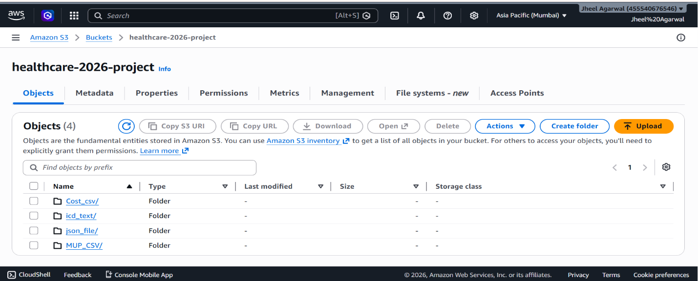
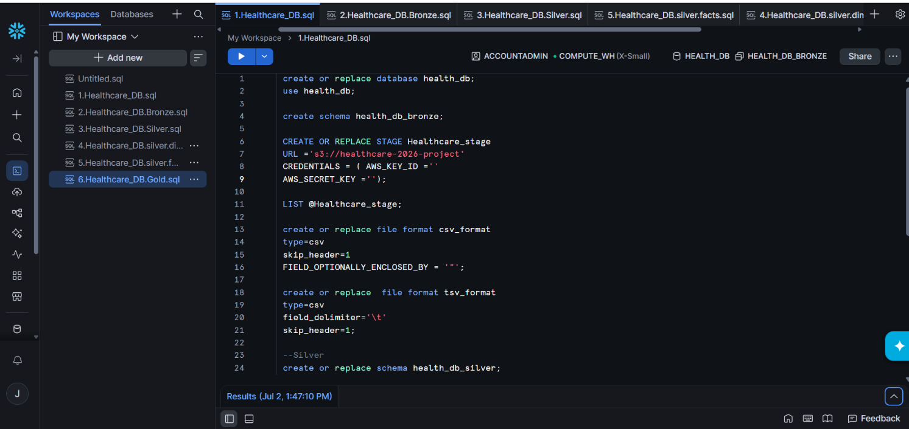
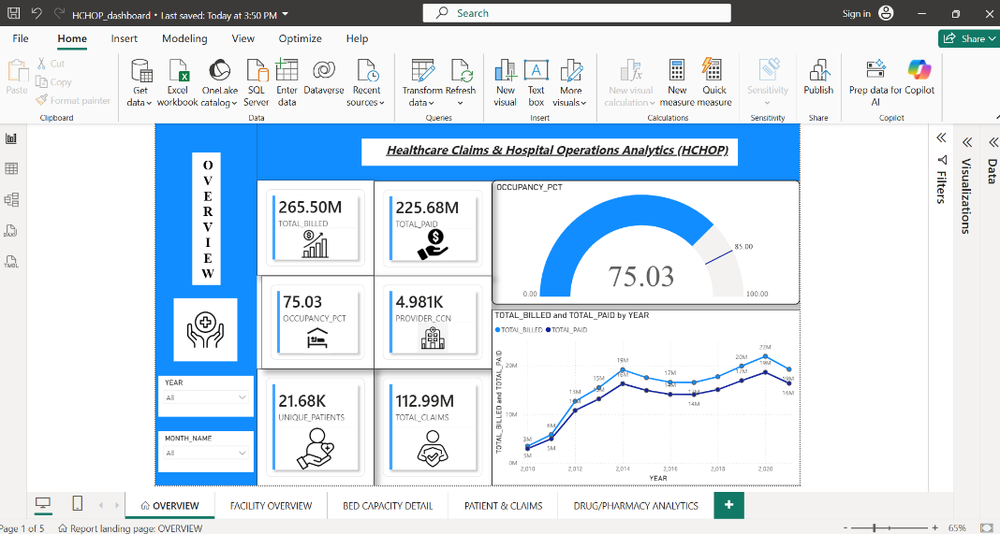
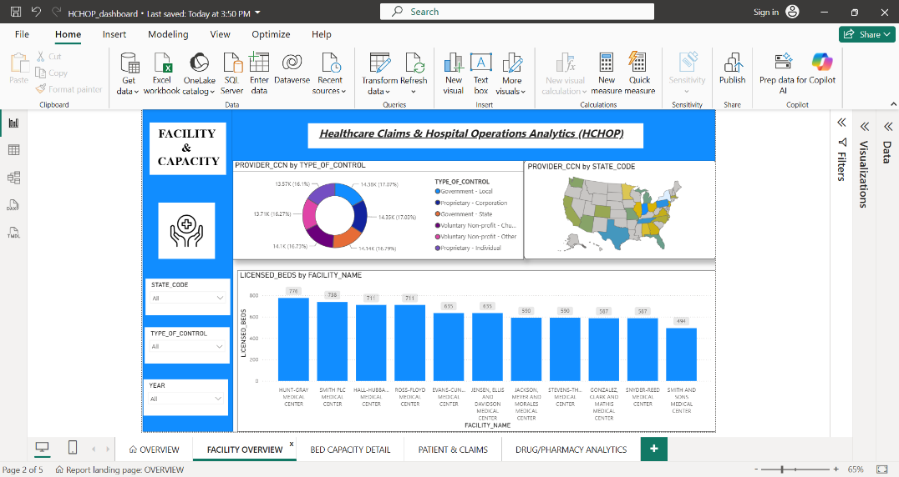
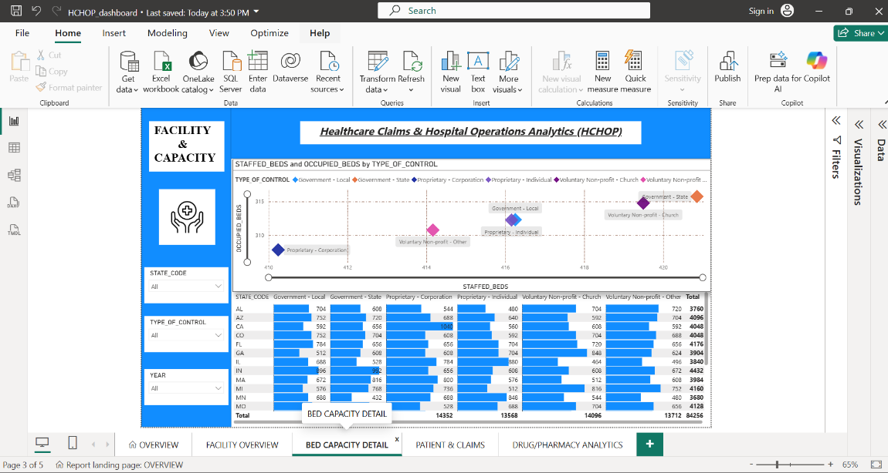
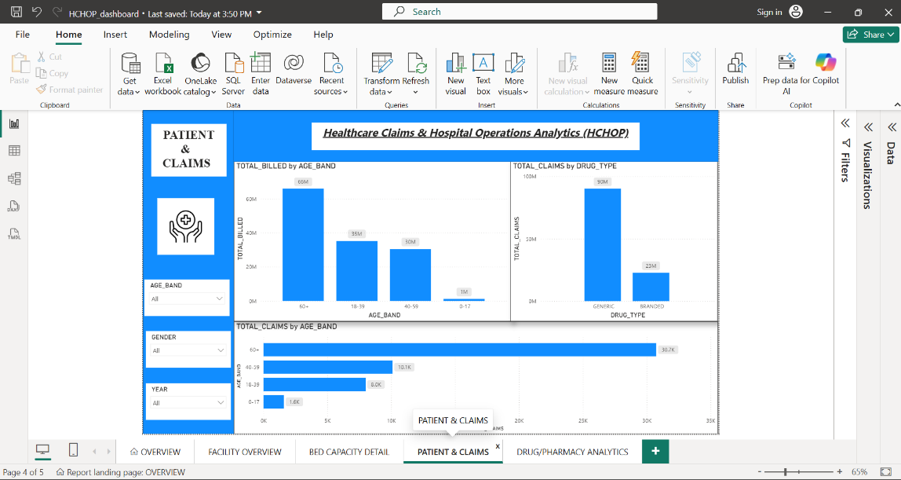
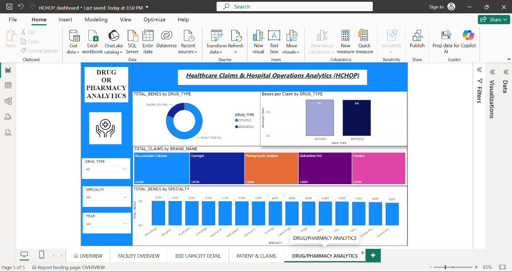

Healthcare Data Warehouse Project

A Snowflake-based healthcare analytics pipeline built with the Medallion (Bronze-Silver-Gold) architecture, connected to a Power BI dashboard.

Table of Contents

•	Project Summary
•	Technology Implementation
•	Presentation Materials
•	Additional Details
•	About This Project
 

Project Summary

The Issue We Are Hoping to Solve

Healthcare organizations generate large volumes of scattered data across claims, prescriptions, patient records, and facility operations. Without a centralized, well-modeled warehouse, it becomes difficult to track billing performance, drug costs, hospital capacity, and patient trends in one place for reliable, timely decision-making.

How Our Solution Can Help

A Snowflake-based data warehouse that transforms raw healthcare data into clean, analytics-ready tables for reporting and dashboarding.

Our Idea

This project implements a Healthcare Data Warehouse on Snowflake, built using a Medallion Architecture (Bronze -> Silver -> Gold). Raw healthcare data - claims, prescriptions, facility, and capacity records - is ingested from an S3 stage into the Bronze layer, cleaned and modeled into dimension/fact tables in the Silver layer, and finally aggregated into business-ready Gold tables such as claims summaries, drug analytics, capacity KPIs, and patient summaries.
These Gold tables are then connected to Power BI to build an interactive dashboard, giving stakeholders visibility into claims trends, billing and collection performance, drug cost patterns, and hospital bed occupancy - all from a single, reliable source of truth.
More detail is available in the SQL scripts in the repository (1.Healthcare_DB.sql through 6.Healthcare_DB.Gold.sql).

Technology Implementation

Technology Used

•	Snowflake - cloud data warehouse used to build the Bronze, Silver, and Gold layers
•	Amazon S3 - staging area for raw source files ingested into Snowflake
•	SQL - used for all ETL/ELT transformations across layers
•	Power BI - used to build the final interactive dashboard on top of the Gold layer

Data Architecture

Layer	Purpose	Key Objects

Bronze:	Raw, as-is data loaded from S3	Staged CSV/TSV source tables
Silver:	Cleaned, conformed dimension & fact tables (SCD tracking via IS_CURRENT)	PATIENT_DIM, FACILITY_DIM, PHYSICIAN_DIM, DIAGNOSIS_DIM, DATE_DIM, FACT_CLAIMS, FACT_CAPACITY
Gold:	Aggregated, business-facing tables and views for reporting/BI	GOLD_CLAIMS_SUMMARY, GOLD_DRUG_ANALYTICS, GOLD_CAPACITY_KPI, GOLD_PATIENT_SUMMARY, MV_CLAIMS_BY_MONTH

Solution Architecture

Step-by-step description of the flow of our solution:

•	Raw healthcare files (claims, drugs, facility, capacity) are uploaded to an S3 bucket.
•	Snowflake ingests these files via an external stage into the Bronze layer.
•	Data is cleaned, deduplicated, and modeled into dimension and fact tables in the Silver layer.
•	Business logic is applied to build aggregated Gold tables (claims summary, drug analytics, capacity KPIs, patient summary).
•	Power BI connects to the Gold layer to power an interactive dashboard for stakeholders.
 
Presentation Materials

AWS Setup

S3 Bucket with Source Files

Snowflake External Stage Configuration

Dashboard Preview

A Power BI dashboard was built on top of the Gold layer tables to visualize claims, drug analytics, capacity KPIs, and patient summaries.

Overview

Facility Overview

Bed Capacity Detail 

Patient & Claims 

Drug/Pharmacy Analytics

Project Development Roadmap

The project currently includes:

•	Bronze, Silver, and Gold layer pipelines in Snowflake
•	Power BI dashboard connected to the Gold layer

Planned next steps:

•	Add dbt models for transformation and testing
•	Add automated data quality checks
•	Add CI/CD for Snowflake script deployment
•	Add a data dictionary / ER diagram

Additional Details

How to Run the Project

Prequisites:

•	A Snowflake account with permissions to create databases, schemas, stages, and file formats
•	An AWS S3 bucket containing the raw healthcare source files (claims, drug, facility, capacity data)
•	AWS access key ID and secret key with read access to the S3 bucket
•	Power BI Desktop (to view/rebuild the dashboard)

Steps:

•	Clone the repo: git clone https://github.com/jheel-cs/Healthcare-Project.git
•	Run the scripts in order in a Snowflake worksheet: 1.Healthcare_DB.sql, 2.Healthcare_DB.Bronze.sql, 3.Healthcare_DB.Silver.sql,   4.Healthcare_DB.silver.dim.sql, 5.Healthcare_DB.silver.facts.sql, 6.Healthcare_DB.Gold.sql
•	In 1.Healthcare_DB.sql, update the S3 stage credentials with your own AWS_KEY_ID and AWS_SECRET_KEY
•	Run each script sequentially to build the Bronze, Silver, and Gold layers
•	Connect Power BI to your Snowflake Gold schema to load/rebuild the dashboard

Usage

Once the Gold layer tables are built, they can be queried directly for analytics or connected to a BI tool for dashboarding, for example:
SELECT YEAR, MONTH_NAME, TOTAL_CLAIMS, TOTAL_BILLED, TOTAL_PAID FROM GOLD.MV_CLAIMS_BY_MONTH ORDER BY YEAR, MONTH;

About This Project

Contributions make the open source community an amazing place to learn and build. Any contributions are greatly appreciated.

•	Fork the Project
•	Create your Feature Branch (git checkout -b feature/AmazingFeature)
•	Commit your Changes (git commit -m 'Add some AmazingFeature')
•	Push to the Branch (git push origin feature/AmazingFeature)
•	Open a Pull Request

Authors

•	Jheel - Initial work - github.com/jheel-cs

License

Distributed under the MIT License. See LICENSE.txt for more information.

Acknowledgments

•	Structure based on the Call for Code Project-Sample template
•	Best-README-Template
•	Snowflake Documentation
